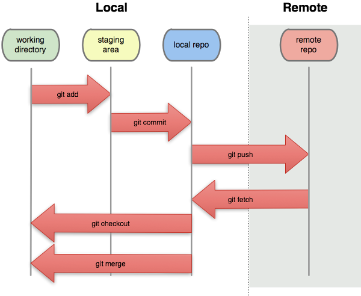

```{r global_options, include=FALSE}
knitr::opts_chunk$set(fig.width=6, fig.height=5.5, fig.align='center', 
                      warning=FALSE, message=FALSE)
```


## Discuss

What is your current version control system?

1. How do you manage different file versions?
2. How do you work with collaborators on the same files?
3. How much would your science suffer if your workstation exploded right now? (scale from 1-10)


## What is git

Version control system

- manage different versions of files
- collaborate with yourself
- collaborate with other people


## Why use git

"Always remember your first collaborator is your future self, and your past self doesn't answer emails" 

- Christie Bahlai


## What is git good for?

- backup
- reproducibility
- collaboration
- organization
- transparency


## What you get

[Tour of a git repository](https://github.com/mbjoseph/trait_factors)


## Overview

1. Git on the command line
2. Git in RStudio
3. Github vs. GitLab vs. Bitbucket for remote mirroring


## Command line git

Make a directory with a file

```
mkdir test
cd test
nano sim.R
```


Then write a short simulation, e.g. 

```{r, eval=FALSE}
x <- rnorm(10)
save(x, file = "x.RData")
```


## Initializing a repository

Prerequisites:

- git installed (check with `which git`)
- git configured (check with `git config --list`)

```
git config --global user.name "Vlad Dracula"
git config --global user.email "vlad@tran.sylvan.ia"
git config --global color.ui "auto"
git config --global core.editor "nano"
```


## Initializing a repository

```
git init
```

Notice the `.git/` directory

## Checking repository status

``` 
git status
```


## Adding your file

```
git add your_filename.R
```

or, to add everything

```
git add --all
```


## Your changes are now staged



(Image from Software Carpentry)

## Committing

Changes aren't final until they're committed

```
git status
```


## Committing

Once you're sure that you're changes are worth saving

(THIS WILL GO ON YOUR PERMANENT RECORD)

```
git commit -m 'changed x, y, and z'
```


## Commit messages

- Describe why and the what "in a nutshell"
- Note to your future self (and to anyone else who you're collaborating with)


## What did we do?

```
git status
git log
```


## Make another change

1. Change file
2. Add changes
3. Commit changes
4. View updated log


## Now, do something really stupid

"Accidentally" introduce some errors to your file


## Woops

Not that this ever happens...

```
git diff
git checkout HEAD your_file.R
```


## What happened?

  

(Image from Software Carpentry)


## Wait, what does HEAD refer to?


(Image from Software Carpentry)


## What if you really screw up?

__A git choose your own adventure__

http://sethrobertson.github.io/GitFixUm/fixup.html


## Mirroring your repository on the internet

__Setting up a "remote"__

1. Create repository on Githubwith no .gitignore, no README, and no license

2. Add that as a remote


```
git remote add origin https://www.github.com/user/test.git
```

__How to check:__ 

```
git remote -v
```

## Once your repository has been linked to remote

Push your changes

```
git push -u origin master
```

Check the remote (Github or  Bitbucket) to see new changes


## Overview

  

(Image from Software Carpentry)


## RStudio's interface

Start a new project

Check it out from your remote git repository using ssh or html

(ssh is better, html may require additional config w/ RStudio)


## Demo of adding, committing, pushing


## Github vs. GitLab vs. Bitbucket

Private repos:

- free on Bitbucket (w/ < 6 collaborators)
- free on GitLab (unlimited collaborators)
- not free on Github


## Github vs. GitLab vs. Bitbucket

- all very similar
- Popularity & user base (4 vs. ?? vs. 1 million)
- free vs. pay
- open source vs. closed source

**You can use all three if you want!**


## Continuing education & additional resources

**Motivation**

- [Ram K. 2013. Git can facilitate greater reproducibility and increased transparency in science.](https://scfbm.biomedcentral.com/articles/10.1186/1751-0473-8-7)

**Instruction**

- [Pro Git](https://progit.org/)
- [Software carpentry](http://swcarpentry.github.io/git-novice/)
- [Git for scientists](http://nyuccl.org/pages/gittutorial/)

**Alternative interfaces**

- [GUIs for the command line averse](https://git-scm.com/book/en/v2/Git-in-Other-Environments-Graphical-Interfaces)


